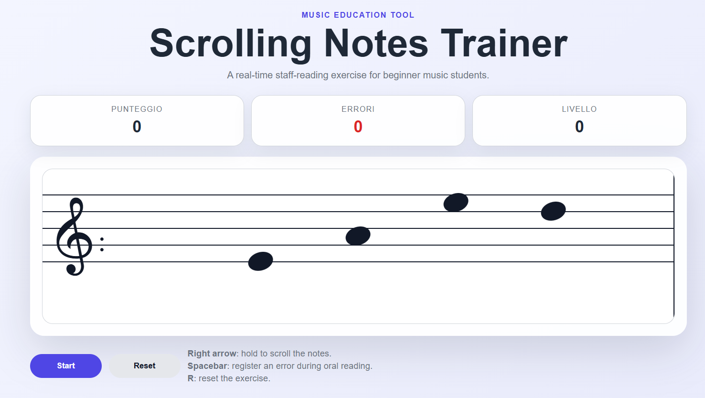

# Scrolling Notes Trainer



A lightweight web-based music education tool designed to support real-time staff-reading practice for beginner students.

The application displays randomly generated notes on a scrolling staff. Students read the notes aloud while the teacher or student tracks reading errors during the exercise.

## Project Context

This project was developed as part of a practical music education workflow for beginner students.

The goal is to make traditional staff-reading drills more dynamic by turning them into a continuous, real-time reading exercise with score progression, increasing speed and error tracking.

## Problem

Beginner music students often need repeated practice to recognize notes on the staff quickly and fluently.

Traditional note-reading exercises can become static and predictable. Students may recognize notes correctly when they have unlimited time, but struggle when asked to read continuously and maintain fluency.

## Solution

Scrolling Notes Trainer introduces a moving staff-reading exercise.

The student follows the scrolling notes and reads them aloud in real time. The score increases while the exercise continues, the visual progression changes over time, and errors can be registered during the activity.

## Main Features

- Random note generation on the staff
- Continuous horizontal scrolling
- Score progression during the exercise
- Speed increase based on score
- Error tracking with the spacebar
- Level progression with background changes
- Keyboard-based interaction
- Lightweight static web implementation

## Controls

| Input | Action |
|---|---|
| Right arrow | Hold to scroll the notes |
| Spacebar | Register one reading error |
| R | Reset the exercise |
| Start button | Start or pause the exercise |
| Reset button | Reset score, errors and generated notes |

## Technical Overview

The application is implemented as a lightweight front-end web tool.

| Layer | Technologies | Responsibility |
|---|---|---|
| Structure | HTML | Page layout and game interface |
| Styling | CSS | Responsive layout, staff rendering, notes and level background |
| Logic | JavaScript | Note generation, scrolling, score calculation, error tracking and level progression |

No build step, backend server or database is required.

## Learning Workflow

```text
Generate random notes on the staff
        |
        v
Student reads the notes aloud in real time
        |
        v
Teacher or student tracks errors with the spacebar
        |
        v
Score increases while the exercise continues
        |
        v
Scrolling speed and visual progression increase over time
```

## Classroom Use and Observed Results

This tool was used as a reinforcement exercise for students who were already showing good progress with traditional note-reading methods.

It was not designed to replace standard solfeggio activities, but to support and strengthen real-time staff-reading fluency. The exercise was used alongside traditional reading practice, oral note recognition and teacher-guided correction.

The main goal was to improve first-sight reading fluency: students had to follow the scrolling staff and read the notes aloud while errors were registered during the exercise.

### Evaluation approach

The activity was evaluated using two practical indicators:

- **score**, used as a proxy for reading continuity and endurance;
- **error count**, manually registered during the exercise.

Higher scores indicate that the student was able to continue reading for a longer time while keeping up with the scrolling staff. However, the score alone is not sufficient: it must be interpreted together with the error rate.

For this reason, the most meaningful indicator is the number of errors relative to the achieved score.

| Performance profile | Score range | Error-rate interpretation | Reading fluency |
|---|---:|---:|---|
| Developing fluency | Low to medium score | High number of errors relative to score | The student can follow the exercise but still loses accuracy under time pressure |
| Stable fluency | Medium to high score | Moderate number of errors relative to score | The student reads continuously with occasional mistakes |
| Strong first-sight fluency | High score | Low number of errors relative to score | The student maintains accuracy even as scrolling speed increases |

### Observed outcome

The tool was especially useful for students who had already developed basic note-recognition skills through other methods.

After repeated use, their first-sight reading improved noticeably: students became faster in recognizing note positions and more confident when reading continuously.

A relevant observation was that approximately 20% of the students were able to keep their error count low even while the score increased. This suggests that, for this group, the exercise supported not only longer reading endurance but also stable accuracy under increasing speed.

These results should be interpreted as observational feedback from classroom use rather than as a controlled experimental study.

### Score and error-rate interpretation

For classroom use, the following interpretation was adopted:

| Indicator | Meaning |
|---|---|
| High score + high errors | Good endurance, but unstable accuracy |
| Medium score + low errors | Good control, but limited reading duration |
| High score + low errors | Strong fluency and reliable first-sight reading |

## Project Structure

```text
scrolling-notes-trainer/
├── index.html          # Main application page
├── styles.css          # Application styling and responsive layout
├── script.js           # Note generation, scrolling and score logic
├── assets/
│   └── .gitkeep        # Placeholder for screenshots or other media
├── LICENSE             # Proprietary license
└── README.md
```

## Local Usage

Clone the repository and open `index.html` in a browser.

```bash
git clone https://github.com/mikabba/scrolling-notes-trainer.git
cd scrolling-notes-trainer
```

Then open:

```text
index.html
```

No build step is required.

## Portfolio Relevance

This project complements my main engineering portfolio by demonstrating my ability to:

- translate a real educational need into an interactive software tool;
- design a simple real-time learning exercise;
- implement dynamic visual behavior using plain JavaScript;
- structure a small front-end project for public documentation;
- build practical tools for non-technical users.

## Known Limitations

- The current version focuses on note-reading fluency rather than automatic note-name validation.
- Errors are manually registered through the spacebar during the exercise.
- The generated notes are randomized and do not currently follow a predefined pedagogical sequence.
- The application is designed as a lightweight browser-based tool rather than a complete music theory platform.

## Future Improvements

- Add configurable difficulty levels
- Add note-name validation mode
- Add different clefs
- Add mobile-friendly touch controls
- Add session summaries with score and error rate
- Add optional exercise presets for specific note ranges

## License and Usage

This project is not released under an open-source license.

The source code is made publicly visible for portfolio review, technical evaluation and demonstration purposes only.

Copying, modifying, redistributing, hosting, selling, sublicensing or creating derivative works based on this project is not permitted without prior written permission from the author.

Copyright (c) 2026 Michele Abbaticchio. All rights reserved.
